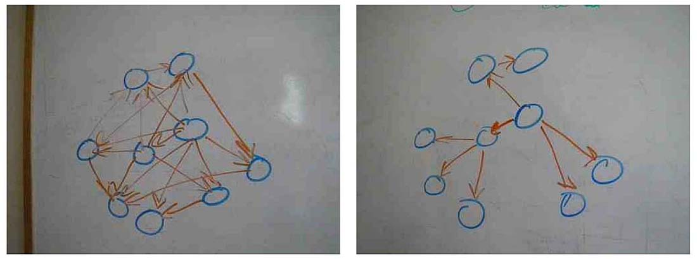

# Chapter 4.

An object oritented application is more than just its classes.  It is made up of classes but defined by messages. Classes control what's in your source code repository and message reflect the living, animated application.

Design deals with:

+ What objects know (Their *responsibilities*)
+ Who they know (Their *dependencies*)
+ How they talk to one another (Their *messages*)

The conversation between objects takes place using their *interfaces*.

## Understanding Interfaces

Imagine two applications consisting of objects and messages passing between them.

In the first application we cannot identify no apparent pattern. Every object may send a message to any other object. The trails left by messages look like a mat.

In the second application we can spot a clear pattern. The objects communicate in specific and well defined ways. The trails left by the messages look like islands occasionally connected by bridged between them.

Applications are characterized by the pattern of their messages.

Objects in the first application are hard to reuse, they expose too much of themselves and know too much about their neighbors. No object stands alone, to reuse any you need all, to change one thing you must change everything.

The second application is made up of pluggable component-like objects. Each reveals as little of itself and knows as little about others as possible.

We can have classes with a single responsibility that use dependency injection and still end up with a mess like the one in the first application. Those two techniques alone are not enough to prevent the construction of a poorly designed application. The root of this new problems lies not in what the classes do but in what they reveal.

All methods in a class are not the same, some are more general or more likely to change than others.

In a well designed application, like the second one, the message patterns are visibly constrained, there are limits to what messages can be passed between objects.

The exposed methods comprise the class's *public interface*.

By interface we are referring to the kind of interface that is within a class: Classes implement methods, some of those methods are meant to be used by others and these methods make up its public interface.

There is another type of interface, one that spans across classes. In this sense, the word *interface* represents a set of messages where the messages themselves define the interface. It's almost as if the interface defines a *virtual* class; that is, any class that implements the required methods can act like the *interface* kind of thing.

## Defining Interfaces

Imagine a restaurant kitchen, customers order food off a menu, the orders come into the kitchen through a little window and the food comes out.

Customers don't need to know how the food is made or to decide what food can be cooked based on the current inventory of the kitchen. They interact with the kitchen using the menu, the kitchen's *public* interface, and inside the kitchen a lot of messages get passed between the workers, these messages are the *private* interface of the kitchen, invisible to the customer.

The customers can ask for *what* they want without knowing *how* it's made.

Our classes are like a kitchen, they fulfill a single responsibility but implement many methods. Methods vary in scale and granularity, some are broad general methods exposing the main responsibility of the class, other ones are tiny utility methods not meant to be used externally.

### Public Interfaces

Methods that make up the public interface of the class, the face it shows to the world:

+ Reveal its primary responsibility
+ Are expected to be invoked by others
+ Will not change on a whim
+ Are safe for others to depend on
+ Are thoroughly documented in the tests

### Private Interfaces

All other methods in the class are part of its private interface. They:

+ Handle implementation details
+ Are not expected to be sent by other objects
+ Can change for any reason whatsoever
+ Are unsafe for others to depend on
+ May not even be referenced on the tests

### Responsibilities, Dependencies and Interfaces

There is a correspondence between the statements you might make about these more specific responsibilities and the classes' public methods.Public methods should read like a description of the responsibilities of the class; a public interface is a contract that articulates the responsibilities of your class.

The public parts of a class are the stable parts; the private parts are the changeable parts. Marking a method as public or private tells users of the class upon which method they may safely depend.

Public methods shold be stable.

### Finding the Public Interface

Finding and defining public interfaces is an art. It is a design challenge that doesn't have a cookie-cutter solution. There are many ways to create a *good enough* interface and the costs of a *not  good enough* interface are not obvious at first so it may be difficult to learn from mistakes.

The design goal will always be to retain the maximum possible flexibility in the future while doing just enough effort to meet today's requirements.

Good public interfaces reduce the cost of unexpected change, bad public interfaces raise it.

#### An Example Application: Bicycle touring company

FastFeet Inc is a bicycle touring company that offers road and mountain bike trips. It runs its business using a paper system with no automation at all.

Each trip follows a specific route and may occur several times during the year. Each has limitations on the number of customers who may go and requires a specific number of guides who double as mechanics.

Each route is rated according to its aerobic difficulty, mountain bikes have an additional rating regarding technical difficulty.

Customers have an aerobic fitness level and a mountain bike technical skill level to determine if a trip is right for them.

Customers may rent bicycles or they may bring their own. FastFeet has some bicycles available and shares a pool of bicycles with local bike shops. Rental bikes come in various sizes and are suitable for either road or mountain trips.

Consider the following simple requirements, which will be referred to later as as a *use case*: A customer in order to choose a trip, would like to see a list of available trips by appropriate difficulty, on a specific date, where rental bicycles are available.

##### Constructing an Intention

Getting started with the first bit of code of a brand new application is intimidating, you must make decisions that will determine the patterns of this application forever. The design that gets extended later is the one that you are establishing now.

You should not dive in and write code. Some experts advocate writing the tests first, but it can be difficult for novice developers imagining the first test.

Test-first gurus can easily start writing tests because they have so much design experience. At the first stage they have already constructed a mental map of possibilities for objects and interactions. They're not attached to any specific idea and use the tests to discover alternatives, but they know so much about design that they have already formed an intention about the application. It is this intention that allows them to specify the first test.

The description of Fast Feet has probably give you some idea about possible classes like Customer, Trip, Route, Bike, Mechanic...

These classes spring to mind because they represent *nouns* in the application of things that have both *behavior* and *data*. They are the domain objects of our application and probably will end up with a representation in the database.

These domain objects are a trap, because if we fixate on them we will coerce unnatural behavior into them. Design experts *notice* domain objects without concentrating on them; they focus not on these objects but on the messages that pass between them. These messages are guides that lead you to discover other objects, ones that are just as necessary but far less obvious.

First than anything you should form an intention about the objects *and* the messages needed to satisfy this use case. One simple and inexpensive way of doing this without writing code is using UML sequence diagrams.

##### Using Sequence Diagrams

UML sequence diagrams enable us to experiment with objects and messages in a low-cost manner.

Sequence diagrams are quite handy. They provide a simple way to experiment with different object arrangements and message passing schemes. They bring clarity to your thoughts and provide a vehicle to collaborate and communicate with others. They're a lightweight to acquire an intention about an interaction. Draw them on a blackboard, alter them as needed and erase them when they've served their purpose.

Figure 4.3 shows a simple sequence diagram representing the implementation of the use case mentioned before. Moe a *Customer* sends the *suitable_trips* message to the *Trip* class an gets back a response.

This sequence diagram can be read as follows: *Customer* Moe sends the *suitable_trips* message to the *Trip* class.

The diagram is almost an exact literal translation of the use case. The nouns in the use case became objects in the sequence diagram and the action of the use case turned into a message. The message requires three parameters: *on_date*, *of_difficulty*, and *need_bike*.

Moe expects the *Trip* class to find him a suitable trip. It seems reasonable that *Trip* would be responsible for finding trips on a date and of a difficulty, but Moe may also need a bicycle and he clearly expects *Trip* to handle that too.

Drawing the diagram exposes the message passing between classes and prompts you to ask the question: "Should *Trip* be responsible  for figuring out if an appropriate bicycle is available for each suitable trip?" or more generally, "Should this receiver be responsible for responding to this message?"

Sequence diagrams explicitly specify the messages that pass between objects, and because objects should only communicate with public messages, they are a great tool for exposing, experimenting and defining public interfaces.

Suddenly the conversation has changed, rather tan talk about classes we're talking about messages. Instead of deciding on a class and figuring out its responsibilities, we're now deciding on a message and figuring out where to send it.

This transition from class-based design to message-based design is a turning point in your design career. The message-based perspective yields more flexible application than does the class based perspective. Changing the fundamental design question from "I know I need this class, what should it do?" to "I need to send this messagem who should respond to it?" is the first step in that direction.

** You don't send messages because you have objects, you have objects because you send messages **

It's perfectly reasonable for a *Customer* to send the suitable_trips message but *Trip* should not receive it.

Now that you hace the *suitable_trips* message in mind but no place to send it, you must construct some alternatives.

Sequence diagrams make it easy to explore the possibilities.

Perhaps there should be a *Bicycle* that should figure out if bicycles are available. *Trip* should be responsible for *suitable_trips* and *Bicycle* for *suitable_bicycle*. Moe can get the answer he needs if he talks to both of them, like in figure 4.4

Figure 4.4 is an improvement in some areas but a failure in others. This design removes extraneous responsibilities from *Trip* but transfers them to *Customer*.

Moe must not only know *what* he wants it but now he must know *how* other objects should collaborate to provide it.

Going back to the kitchen metaphor, Moe isn't ordering from a menu, he's going into the kitchen and cooking. *Customer* is taking responsibilities that belong somewhere else and is binding itself to an implementation that might change.

##### Asking for what instead of how

There is a subtle, yet important, distinction between a message that that asks for what the sender wants and a message that tells the receiver how to behave. Understanding this difference is a key part of creating reusable class with well-defined public interfaces.

To understand the difference between *what* vs *how* let's put the customer and trip design problem to rest for a while.

In figure 4.5 a trip is about to depart and it needs to make sure all the bicycles scheduled to be used are in good shape. The use case is: A trip, in order to start, needs to ensure that all its bicycles are mechanically sound. *Trip* could know exactly how to make a bike ready for a trip and could ask a *Mechanic* to do each of those things.

We can see that *Trip* knows many details about what a mechanic does. This knowledge means that with any change to the *Mechanic* process of preparing a bike, *Trip* must change.

Figure 4.6 depicts an alternative where *Trip* asks *Mechanic* to prepare each bicycle, leaving the implementation details to *Mechanic*.

*Trip* has delegated the responsibility of preparing a bicycle to *Mechanic*, *Trip* is concerned with what it wants not how to achieve it. Any change in the implementation details of how to prepare a bicycle for a trip will not affect *Trip*

One side effect of changing the conversation between *Trip* and *Mechanic* from *how* to *what* is reducing the size of the public interface of *Mechanic*. Because mechanic promises that its public interface is stable and unchanging, having a small public interface means that there are few methods for others to depend on. This reduces the possibility of *Mechanic* someday changing its public interface, braking its promise and causing unexpected changes somewhere else in the application.

This is a great improvement on maintainability but *Trip* still knows a lot about *Mechanic*. The code would be more flexible and more maintainable if *Trip* could work while knowing even less.

##### Seeking Context Independence

The things that an object knows about other objects make up its context. *Trip* has a single responsibility but expects a context. In this case, the existence of an object that can respond to the prepare_bicycle message.

Context is a coat that *Trip* wears everywhere, any use of *Trip* for testing or any other, requires the existence of a *Mechanic* object that can prepare the bicycles. *Trip* cannot be reused without providing a *Mechanic*-like object that responds to *prepare_bicycle*.

There is a direct effect of an object's context in the ability to reuse it. Objects with simple contexts are easier to use and test, they expect few things from their surroundings. Objects with a complex context are hard to use and test, they require a complex setup.

The best possible situation for an object is to be completely independent of its context and being able to collaborate with others with no need of knowing who they are. The technique for achieving this, dependency injection, was studied earlier in the book.

The new challenge is to make *Trip* invoke correct behavior from *Mechanic* without knowing what *Mechanic* does. The solution to this problem lies in the distinction between *what* and *how*, and arriving at a solution requires concentrating on what *Trip* wants.

*Trip* wants to be prepared, the need to be prepared is within the realm of *Trip*, however, the knowledge that bicycles must be prepared may belongs in the province of *Mechanic*. Bicycle preparation is more related to how a *Trip* gets prepared than to what a *Trip* wants.

In this design *Trip* knows nothing about *Mechanic*, it just knows that there is an object that responds to the *prepare_trip* message and invokes said message passing *self* as a parameter.

Now all the knowledge about how mechanics prepare trips is contained inside the *Mechanic* class, *Mechanic* even takes care of calling back *Trip* and asking for the list of bicycles that need to be prepared.

Both of the objects are now easier to change, test and reuse.

##### Trusting other objects

The design illustrated from Figure 4.5 to Figure 4.7 represent a movement towards increasingly object-oriented code and mirror the stages of of development of a novice designer.

Figure 4.5 is quite procedural. *Trip* tells a *Mechanic* how to prepare a bicycle, as if *Trip* were the main program and *Mechanic* a bunch of callable functions.

Figure 4.6 is more object-oriented. *Trip* asks *Mechanic* to prepare a bicycle. *Trip*'s context is reduced and so is *Mechanic*'s public interface. Also, now you don't need a *Trip* to prepare a bicycle; the *prepare_bicycle* method is reusbale in other contexts.

Responsibilities are placed in the correct places but *Trip* still has more context than necessary, still must have and object that responds to *prepare_bycicle*.

Figure 4.7 is far more object-oriented. *Trip* doesn't know or care that it has a *Mechanic* and has no idea about what it'll do. *Trip* holds to an object to which it will send the *prepare_trip* message and expect said object to behave appropriately.

*Trip* could even place this kind of objects in an array and send each the prepared message, trusting every preparer to its thing. This way we can add new preparers to *Trip* without changing its code. We can **extend** *Trip* without **modifying** it.

This blind trust that objects will do their job without concerns about how they do it is a keystone of object-oriented design. It allows objects to collaborate without binding themselves to context. It's necessary in any application that expects to grow and change.

##### Using Messages to Discover Objects

With the knowledge of the distinction between *what* and *how* let's go back to original design problem from *Figure 4.3* and *Figure 4.4*.

The use case for the problem was: A customer would like to see a list of available trips of appropriate difficulty, on a specific date, where rental bicycles are available.

Neither of the designs was reusable or tolerant to changes. Both were tightly coupled and responsibilities were incorrectly assigned, and objects had more than one responsibility. In Figure 4.3 *Trip* knows too much, in Figure 4.4 *Customer* knows too much, tells other objects how to behave, and requires too much context.

It is completely reasonable to send the *suitable_trips* message, that's why it appears in both sequence diagrams. The problem is not with the message, clearly, *Customer* should send it, the problem is with the receiver.

This application needs and object that embody the rules at the intersection of *Customer*, *Trip* and *Bicycle*. The *suitable_trips* message will be part of its public interface.

You can take many routes to realize that you need yet undefined objects, the advantage of discovering this missing via sequence diagrams is that the cost of being wrong is very low and the impediments of to changing your mind are extremely few. Sequence diagrams are experimental and will be discarded, we lack any attachment to them. They create an intention that is the starting point for your design.

Perhaps the application should contain a *TripFinder* class, responsible for finding *suitable_trips*, like it's shown in Figure 4.8.

*TripFinder* contains all knowledge of what makes a trip suitable suitable. It knows the rules and does whatever necessary to respond to the *suitable_trips* message. It provides a consistent public interface while hiding messy, changeable internal implementation details.

Now that the behavior has been extracted from *Customer* it can be used in isolation by any other object.

##### Creating a Message Based Application

Sequence diagrams are powerfully useful in a transient way; they make otherwise impossibly convoluted conversations comprehensible.

Useful as they are, they're a tool, nothing more. They help keep the focus on messages and allow you to form a rational intention about the first thing to assert in a test.

Switching attention from objects to messages allows you to concentrate on designing an application built upon public interfaces.

### Writing Code That Puts its Best Interface Forward

Since our design skills are always improving but never perfected and because even today's beautiful design may look ugly in light of tomorrow's requirements; it is difficult to have perfect interfaces.

This shouldn't deter us from trying. To evolve interfaces must first be born. It is more important to have a well-defined interface existing than it being perfect.

**Think** about interfaces, they must be created intentionally for they are the ones that define your application, more than all of your tests and any of the code.

#### Create Explicit Interfaces

You should write code that works today but that is adaptable to changes in the future and that can be reused for new purposes. Since others will be using your methods, you must communicate which ones are dependable.

Methods in the public interface should:

+ Be explicitly defined as such
+ Be more about what than how
+ Have names that, insofar as you can anticipate, will not change
+ Take a hash as ab options parameter.

You should be as intentional about the private interface too. Test should not include the private methods, or if they do, should be isolated from the tests of the public methods. Since tests can serve as documentation for an interface, testing private methods could send wrong signals about their reliability.

Ruby provides three keywords **public**, **private** and **protected**. Use of these keywords serves two distinct purposes. They indicate which methods are stable and which are not. Second, they control the visibility of a methods to other parts of the application.

#### Public, Protected and Private keywords

The **private** keyword denotes the least stable kind of methods and provides the minimum visibility. They must be called from within the implicit receiver.

The **protected** keyword also indicates that a method is unstable but with slightly different visibility restrictions. Protected methods allow explicit receivers as long as the receiver is **self** or an instance of the same class or subclass of **self**.

Ruby supplies with several mechanism to bypass these visibility restrictions imposed by **private** and **protected**.

Users of a class can redefine any method to **public**. The **private** and **protected** keywords are more like flexible barriers than concrete restrictions. The notion that preventing method acces by using these keywords is just an illusion; they just make access harder, sending two messages:

+ You believe that you have better information **today** than programmers will have in the future.
+ You believe that those future programmers need to be prevented from accidentally using a method that you currently consider unstable.

There are other ways to communicate stability, for example, Ruby on Rails use a naming convention where private methods are not blocked by a keyword but simply prefixed with a `_`.

Regardless if how you choose to do so, as long as you find some way to convey this information, you have fulfilled your obligations to the future.

#### Honor the Public Interfaces of others

You should try hard to interact with other classes using only their public interface. Assume that the authors of those classes were as intentional as you and are trying desperately, across time and space, to communicate which methods are stable and dependable.

If your design forces the use of a private method in another class, rethink your design. Try real hard to find an alternative.

Depending on a private interface increases the risk of being forced to change. If the private interface is part of an external framework that undergoes periodic change, the dependency becomes a time bomb that will go off at the worst possible moment.

A dependency on a private method of an external framework is a form of technical debt.

#### Exercise Caution when Depending on Private Interfaces

Sometimes even after doing our best, you find that you must depend on a private interface. This dangerous dependency should be isolated with the techniques studies in Chapter 3. Even if you cannot avoid the dependency on a private method, you can avoid referencing it multiple times across the application.

Depending on a private interface increases risk, keep it to a minimum by isolating the dependency.

#### Minimize Context

Construct public interfaces with an eye towards minimizing the context they require from others, keeping the **what** vs **how** distinction in mind.

Create public methods that allow senders to get what they want without knowing how the class implements the behavior.

Also, don't surrender to a class with an ill-defined or absent public interface. When facing a class that forces you to think of implementation details, try to isolate them like we did with the mechanic example. The isolation could come in the form of a method you add to the class, that abstracts the behavior, a wrapper intermediate class or a wrapping method inside your own class.

Do what best suits your needs, but create some kind of defined public interface and use it. This reduces your class's context and makes it easier to reuse and simpler to test.

### The Law of Demeter

Having read about responsibilities, dependencies and interfaces it's time to explore the Law of Demeter, a set of coding rules that result in loosely coupled objects.

Loose coupling is nearly always a virtue but is just one component of design and must be balanced against competing needs. Some Demeter violations are harmless, but others expose a failure to correctly identify and define public interfaces.

#### Defining Demeter

The Law of Demeter restricts the set of objects to which a method may *send* messages, it's often paraphrased as "only talk to your inmediate neighbors" or "use only one dot".

#### Consequences of violations

TODO

#### Avoiding violations

TODO

#### Listening to Demeter

TODO

### Summary

Object-oriented applications are defined by the messages that pass between objects. This message passing takes place along "public" interfaces; well-defined public interfaces consist of stable methods that expose the responsibilities of their underlying classes and provide maximal benefit at minimal cost.

Focusing on messages reveals objects that might otherwise be overloaded. When messages are trusting and ask for what the sender wants instead of telling the receiver how to behave, objects naturally evolve public interfaces that are flexible and reusable in novel and unexpected ways.
