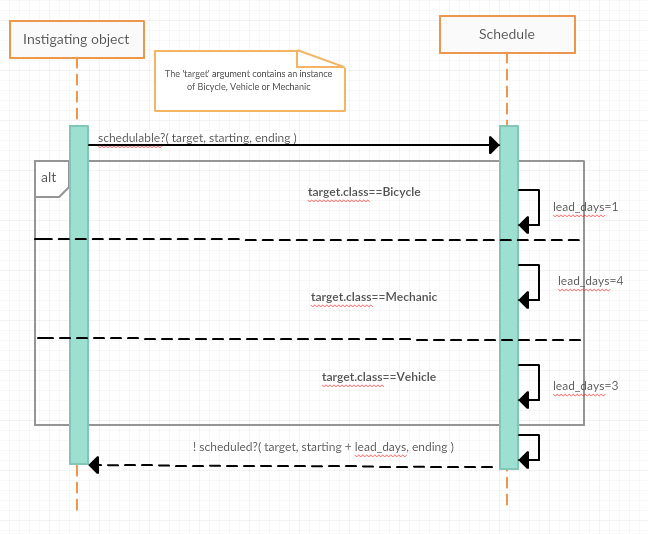
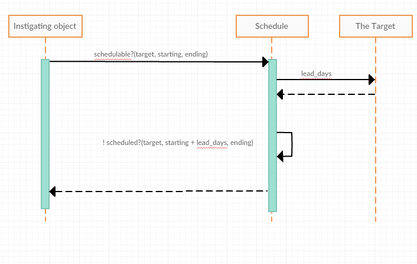

# Sharing Role Behavior with Modules

Sometimes we need to share common behavior across classes that don't share an abstraction/specialization relationship. For example, FastFeet could need a recumbent mountain bike.

There are times when inheritance makes sense, and time when it does not. You must understand when to use it and when not to use it. Use of classical inheritance is always optional; every problem that it solves can be solved in other way.

No design is free, we must make design decisions by doing tradeoffs between relative costs and likely benefits of the alternatives.

## Understanding roles

Sometimes we need to share behavior among unrelated classes that don't respond to the sperclass/subclass requirement of classical inheritance, this relation between classes is a role that the class plays.

Unrelated objects that play a role enter into a relationship with the objects they play the role for. These kind of relationships are not as visible as those created by classical inheritance, and of course, this relationship introduces costs that must be take into account when deciding among design options.

### Finding roles

The *Preparer* duck-type from Chapter 5 is a role, played by objects that implement that interface. *Mechanic*, *TripCoordinator* and *Driver* are *preparers* because they implement the *prepare_trip* public method, objects can interact with them and treat them like a preparer without concerns for their class.

Roles usually come in pairs, so the existence of a *Preparer* role suggest the existence of *Preparable*, another role, in Chapter 5, *Trip* acted as a *Preparable* whose interface implements all the messages that any *Preparer* might expect to send to a *Preparable*.

*Preparable* is a simple role, to play it an objects simply needs to implement the *prepare_trip* method. *Preparable* objects only share the method signature but no other code.

There are more complex roles where not only a method signature is shared but also specific behavior via code. We need to organize our code so we define the behavior in one place but makie it usable by any object that acts as a *Preparable*.

In Ruby we have *modules*, a mechanism provided by the language in order to define a named group of methods that can be mixed into an object. This mechanism exists in many OOP languages, and it's called mixins.

Methods can be defined in one module and then this module can be added to any object, this allows objects of different classes to play a common role using shared code.

**When an object includes a module, the methods defined therein become available via automatic delegation**, it is a similar mechanism to the one used by classical inheritance, when an object receives a message it does not understand it gets automatically routed somewhere else.

By adding modules to our codebase, and including those modules in our objects we are entering a new realm of design complexity. The total set of messages to which an object can respond to includes:

+ Those it implements
+ Those implemented in all objects above it in the hierarchy
+ Those implemented i any module that has been added to it
+ Those implemented in all modules added to any objects above it in the hierarchy

### Organizing Responsibilities

Let's think about the problem of scheduling a trip. *Trips* occur at specifics points in time and involve objects from the physical world that cannot be in two places at the same time (bicycles, mechanics...). FastFeet needs a way to arrange these objects in a schedule, in order to know which are available and which not, at a certain time.

The problem is more complex than simply checking is an object is idle during a specific time frame, these objects needs downtime between trips, bikes need maintenance, mechanics must go home on weekends and holidays.

Bicycles should have at least one day between trips, mechanics, four days.

The code for this example will start with some alarming code that will evolve trough several refactorings until reaching a satisfying solution, while exposing probable anti-patterns.

Let's assume an *Schedule* class exists, with the following interface:

````(ruby)
scheduled?(target, starting, ending)
add(target, starting, ending)
remove(target, starting, ending)
````

All the methods receive these three arguments: target object, start date and end date.

To schedule an object for a *Trip* it is necessary to know if the object is alredy busy in a certain time frame, but it's also necessary to know about the lead time of each object.

Figure 7.1 shows an implementation where *Schedule* takes care of that responsibility. The *schedulable?* method knows all the possible values and checks the class of the incoming target to decide which lead time to use.



This pattern of checking the class to know what message to send is not new. The knowledge of the specific *lead_days* of each class does not belong in *Schedule*, it creates a dangerous dependency, this knowledge belongs in the classes that *Schedule* is checking.

### Removing Unnecesary Dependencies

Since *Schedule* checks class names of one argument to set the value of a variable, we should turn this variable into a message that should be sent to each incoming object.

#### Discovering the Schedulable Duck Type

I figure 7.2 we have an implementation that removes the conditional that asked for the incoming object's class. The responsibility for knowing the number of lead days has been passed to the target object that must implement the *lead_days* message.



Normally, the boxes on sequence diagrams are used to hold the name of the class they represent, but in the case of *the target*, it can be many classes, so we chose a generic name, because it's not obvious at first how to name the class. The *Schedule* clearly does not care about the class of the object, as long as it implements the *lead_days* message, this message based expectation transcends classes and exposes a role, played by all objects passed as the *target* parameter to the *schedulable?* message.

Just like we discovered the *Preparer* duck type in chapter 5, we've just discovered a new duck type, the *Schedulable* role. For now, *Schedulables* must implement the *lead_days* message but share no other code in common.

#### Letting objects speak for themselves

Using this duck type improves our application, by removing the dependency on specific class names, which makes our code easier to maintain and more adaptable to future changes. However, our design still contains unnecessary dependencies that must be removed.

Objects should manage themselves, if I'm interested about object B, I have no reason to know about object A. In this case, if I want to know if a *Schedulable* object is available to be scheduled, I should ask it directly, rather than using an intermediate *Schedule* object.

### Writing the Concrete Code
